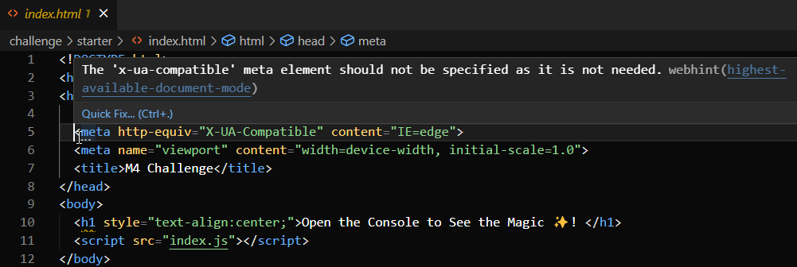

# Console-Finances
Module 4 Challenge - JavaScript: Console Finances
    1. Upon my Initial perusal of the requirements ReadMe file, in reference to the financial dataset in the starter/index.js file, I came across the term "arrays with two fields". Was this an array of arrays? I googled "arrays with two fields" and the first webpage I landed on was this - JavaScript2D Array - Two Dimensional Arrays in JS. On the heading image there was a indicator that it was array of arrays that we're talking about. Interestingly, the introduction read as follows: 

        "In JavaScript programming, we are all used to creating and working with one-dimensional arrays. These are arrays that contain elements (elements of similar data types or multiple data types).

        "But it’s also good to know that two-dimensional arrays (2D arrays) exist in JS.

        "In this article, you will learn what two-dimensional arrays are and how they work in JavaScript. It is quite different from other programming languages because, technically, there is no two-dimensional array in JavaScript."

        
...no two-dimensional array in JavaScript

Huh?

But then there follows some clarification:

        "In JavaScript, there is no direct syntax for creating 2D arrays as with other commonly used programming languages like C, C++, and Java.

        "You can create two-dimensional arrays in JavaScript through jagged arrays — an array of arrays."

I may have learned the syntax with other languages, but it escapes me now. So, I don't need to unlearn things to deal with JavaScript's quirkiness. :-)

And so, as I first guessed, "array with two fields" is an "array of arrays". For this challenge, I'm using this. Of course, I reserve the right to change my mind as we go along. 

2. VSCode (ESLint to be specific) is such a nag. In the index.html head section, why is the X-UA-Compatible meta element not needed? Found a Stack Overflow question/answer on it - https://stackoverflow.com/questions/26346917/why-use-x-ua-compatible-ie-edge-anymore. Blah blah blah - something to do with Internet Explorer which is no longer supported - hurrah! So, I removed it.
     

3. Changed the type of array of array from var to const

4. TypeError: Cannot read properties of undefined (reading '1')
    at Object.<anonymous> 

I have a javascript array of two fields. I want to get the average of the changes to the elements of the second column over the entire perdiod

    First you can calculate the changes using map, and putting 0 in the first value of the array.

    Read up on map and learn the syntax

    The Array.map() method creates a new array from the results of calling a function for every element.

financesArr[i][1].map(Math.abs(num1 - num2))

const changes = financesArr.map((element, index) =>
  index === 0 ? 0 : element - profitLosses[index - 1]
);

const total = profitLosses.reduce((acc, item) => acc + item, 0);
const averageChange = total / (profitLosses.length - 1);

console.log(averageChange);

===

    Then you sum the changes using reduce.

    Then you divide by the length-1 (because there are one less changes than there are profit&losses)

toFixed - toFixed(x) is an inbuilt function in JS. It is used to round off a decimal number to specific decimal places.
    